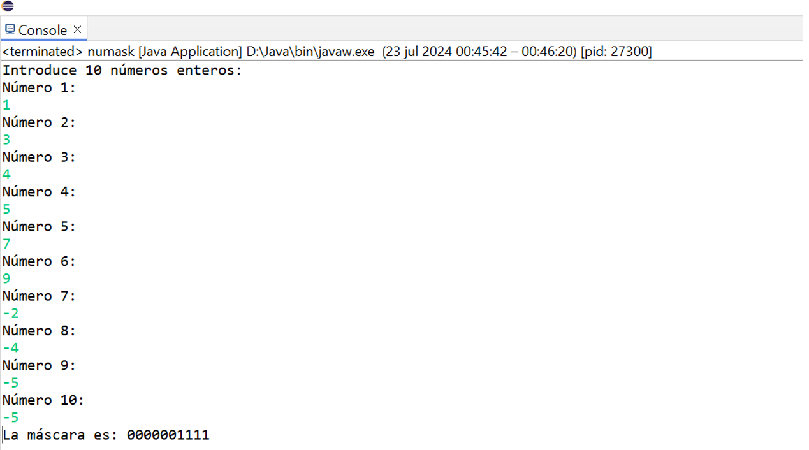

# Mascara_numeros
El programa generará una máscara de números de 0's y 1's para una serie de 10 números enteros.

## Instrucciones
Dentro de un sistema computacional se requiere crear una máscara de ceros y uno para una secuencia de números de tal forma que se asigne un 0 para los valores positivos y el 1 para los negativos.

**Ejemplo:** La secuencia: 1, -3, -5, 8, 9, -6, -43, -8 tendría la siguiente máscara: 01100111.

Escribe un programa que lea una secuencia de 10 números enteros y despliegue en pantalla la máscara.

### Restricciones del programa
El programa debe contener un método de nombre getMask que regrese como resultado la cadena de caracteres que contiene la máscara.

### Tecnologías que se utilizaron:
**JAVA**

### El programa debe presentar una pantalla como la siguiente al momento de ser compilado: 

